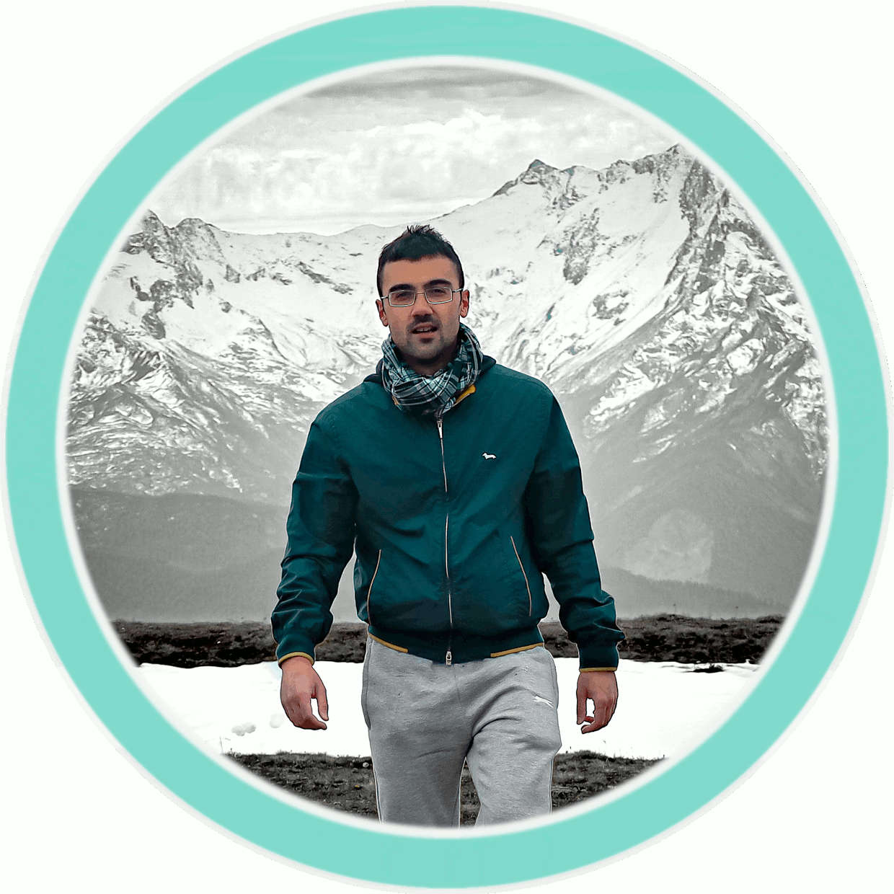

+++
date = "2020-04-28T21:05:33+05:30"
title = "Chi sono"
url = "about"
type = "page"
+++


Ciao! sono Nicola 
e questo è il mio blog.





    



Sono appassionato di informatica, di programmazione, di nuove tecnologie.
Nel tempo libero programmo in C#, Java, PHP con mySQL, JavaScript e CSS.

Amo creare.

Nel restante del tempo faccio il medico. E studio per continuare a farlo al massimo delle mie capacità. 
Spesso mi sento fortunato ad esserlo.

Ho vissuto un anno in Lituania. In quell'anno ho capito che il mondo è grande e vario, e merita di essere interpretato, vissuto. Per quello, appena ho potuto, son partito in Giappone. A fare il medico. Dopo l'esperienza lituana, in cui ho vissuto a -20°C, l'esperienza giapponese è quella che mi ha arricchito di più. 

Amo leggere. Manuali tecnici. Le letture da relax non fanno per me. Ultimamente mi sto appassionando all'_intelligenza artificiale, al data science_.

L'_autunno_ è la mia stagione preferita per viaggiare, e cerco di concentrare i viaggi il più possibile in quella parte dell'anno. Mi piacciono i colori che porta, l'aria fresca e frizzante, la maggiore vivibilità delel giornate che sono ancora sufficientemente lunghe per poter esplorare in lungo e largo nuovi luoghi.  
Preferisco un viaggio avventuroso ad una vacanza, sebbene non disdegni queste ultime. Semplicemente - non fanno per me - ma se mi dovesse capitare l'occasione non rifiuterei.
Il viaggio avventuroso mi offre più possibilità di crescita, di invenzione, di novità.

Amo le lingue, per quanto dedichi loro meno tempo di quello che dovrei. L'inglese come base, in passato mi son avvicinato al russo durante la permanenza in territorio ex-URSS. 

Attualmente cerco di mettere le basi per il tedesco.

Sognatore, perfezionista.